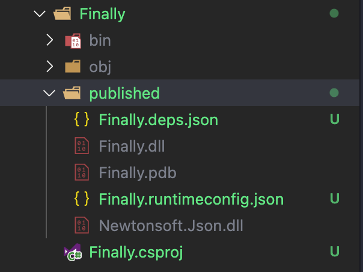

# .NET 5 的编译，打包发布


## 编译
.net core 的编译`dotnet build`会在很多命令运行中作为前提条件运行，其结果也会包含在高级命令结果里面，如`dotnet run`,`dotnet publish`

`dotnet build` 命令将项目及其依赖项生成为一组二进制文件。 二进制文件包括扩展名为 .dll 的中间语言 (IL) 文件中的项目代码。 根据项目类型和设置，可能会包含其他文件，例如：
- 可用于运行应用程序的可执行文件（如果项目类型是面向 .NET Core 3.0 或更高版本的可执行文件）。
- 用于调试的扩展名为 .pdb 的符号文件。
- 列出了应用程序或库的依赖项的 .deps.json 文件。
- 用于指定应用程序的共享运行时及其版本的 .runtimeconfig.json 文件。
- 项目通过项目引用或 NuGet 包引用所依赖的其他库。


### 编译命令：dotnet build
```bash
dotnet build [<PROJECT>|<SOLUTION>] [-c|--configuration <CONFIGURATION>]
    [-f|--framework <FRAMEWORK>] [--force] [--interactive] [--no-dependencies]
    [--no-incremental] [--no-restore] [--nologo] [-o|--output <OUTPUT_DIRECTORY>]
    [-r|--runtime <RUNTIME_IDENTIFIER>] [--source <SOURCE>]
    [-v|--verbosity <LEVEL>] [--version-suffix <VERSION_SUFFIX>]

dotnet build -h|--help
```

`dotnet build`本质上还是使用了`MSBuild`,所以它接受MSBuild选项


## 打包发布：
.net core 支持跨平台部署运行。比如说：部署在Windows、Linux、MaxOS...，OS层面,是否需要部署.NET Runtime运行时，.NET Runtime运行时的版本选择，等等。
### 两种应用程序发布模式
1. 以自包含的方式发布应用程序
  - 这种模式包含.NET运行时和应用程序及其依赖项的应用程序。我们可以在未安装.NET运行时的操作系统上运行它，总结一句话：把.NET Runtime运行时打包到程序运行目录中，应用程序运行的主机不需要安装.NET Runtime运行时。
    - Windows-x64: `dotnet publish -r win-64`
    - MacOS-x64:`dotnet publish -r osx-x64`
    - Linux-64:`dotnet publish -r linux-x64`
2. 以依赖于框架的方式发布应用程序
  - 生成一个仅包含应用程序本身及其依赖项的应用程序。应用程序的运行环境必须单独安装.NET运行时，总结一句话：不包含.NET Runtime运行时，只有应用程序本身和依赖的应用程序。应用程序运行的主机需要单独安装应用程序所需的.NET Runtime运行时。
  - 如果是在源码所在环境中，只需要运行`dotnet publish --configuration Release`
  - 如果是在特别指定的环境中：
    - Windows-x64: `dotnet publish --framework netcoreapp3.1 --runtime osx-x64 --self-contained false`
    - MacOS-x64:`dotnet publish  --framework netcoreapp3.1 --runtime osx-x64 --self-contained false`
    - Linux-64:`dotnet publish --framework netcoreapp3.1 --runtime linux-x64 --self-contained false`

### 发布指令：dotnet publish
- dotnet publish -将应用程序及其依赖项发布到指定的文件夹中，以方便后续部署到目标托管系统，默认先运行`dotnet build`
- 默认情况下会找到所在根目录下面的工程文件，当然也可以指定：`dotnet publish Finally.csproj`

```bash
dotnet publish [<PROJECT>|<SOLUTION>] [-c|--configuration <CONFIGURATION>]
    [-f|--framework <FRAMEWORK>] [--force] [--interactive]
    [--manifest <PATH_TO_MANIFEST_FILE>] [--no-build] [--no-dependencies]
    [--no-restore] [--nologo] [-o|--output <OUTPUT_DIRECTORY>]
    [-p:PublishReadyToRun=true] [-p:PublishSingleFile=true] [-p:PublishTrimmed=true]
    [-r|--runtime <RUNTIME_IDENTIFIER>] [--self-contained [true|false]]
    [--no-self-contained] [-v|--verbosity <LEVEL>]
    [--version-suffix <VERSION_SUFFIX>]
```
- dotnet publish 将编译应用程序，读取其在项目文件中指定的依赖项，然后将结果文件集发布到目录中。输出包括以下内容：
  - 具有dll扩展名的程序集中的中间语言（IL）代码。
  - 一个.deps.json文件，其中包含项目的所有依赖项。
  - 一个.runtimeconfig.json文件，它指定应用程序期望的共享运行时，以及该运行时的其他配置选项（例如，垃圾收集类型）。
应用程序依赖的应用程序，从NuGet缓存目录复制到输出文件夹中。
- DEMO新建一个.NET 5的Console应用程序来演示:
  ```bash
  dotnet new console
  dotnet add package Newtonsoft.Json
  ```
  ```C#
  using System;
  namespace Finally
  {
      class Program
      {
          static void Main(string[] args)
          {
              var msg = Newtonsoft.Json.JsonConvert.SerializeObject("Hello .NET 5!");
              Console.WriteLine(msg);
              Console.ReadKey();
          }
      }
  }
  ```
- 首先，编译一下这个工程dotnet build，然后，使用命令行执行dotnet publish指令：
- \bin\Debug\net5.0\publish\目录下生成的文件：
  1. 具有dll扩展名的程序集中的中间语言（IL）代码：`Finally.dll`
  2. 一个.deps.json文件，其中包含项目的所有依赖项。`Finally.deps.json`
  3. 一个.runtimeconfig.json文件，它指定应用程序期望的共享运行时，以及该运行时的其他配置选项（例如，垃圾收集类型）`Finally.runtimeconfig.json`
  4. 应用程序依赖的应用程序，从NuGet缓存目录复制到输出文件夹中。Newtonsoft.Json.dll
  5. 同时，如果是在windows平台,还会有可执行文件：`Finally.exe`


## 部署

1. ASP.NET Core 自带webserver, 因为它默认内嵌了`Kestrel server`,于是你可以直接把`dotnet publish`之后的文件放到你想要部署的机器上，然后运行：`dotnet xxx.dll`
    - 优势：足够简单，拷贝文件就开整。
    - 缺陷：如果控制台关掉了，服务器重启了会怎样？此时需要手动重新去重新执行。


2. 使用第三方web server来托管asp.net core , 如著名的windows server 下的IIS, 可以通过安装`ASP.NET Core Module`（IIS对接ASP.net core的一个可选模块）来把asp.net core 安排进IIS的管道流程，有两种模式：
    - 在IIS的工作进程w3wp.exe中直接调用ASP.NET Core app的处理管道, 即进程内托管
    - 把IIS用来转发Http Request, 另启进程用`Kestrel`跑ASP.NET,即进程外托管
3. 一般来说，我们会把IIS当成负载服务器，转发请求，同样的有`Nginx`,`Apache`等


### Docker

关于Docker基本步骤就是：
1. 在部署的环境中安装Docker
1. 编写 Dockerfile
2. 使用 docker build 构建镜像
3. 使用 docker run 创建容器并运行

下面只是大概写下 Docker 部署的步骤，抛砖引玉：
- 我们假设发布包路径如下：
```folder
root-folder/
  app/ # 发布包目录
    xxx.dll # 程序入口点 
  Dockerfile # Dockerfile文件
```
- 然后针对该程序，编写如下 Dockerfile：
```dockerfile
# 根镜像
FROM microsoft/dotnet:2.2-runtime

# 拷贝程序发布包
COPY app /app

# 设置工作目录
WORKDIR /app

# 导出的端口
EXPOST 80

# 程序运行命令
CMD ["dotnet", "xxx.dll"]
```
- 接下来，通过在 root-folder 中执行 docker build -t xxx:0.0.1 . 来构建一个镜像。

- 接着，再通过 docker run -it -p 8000:80 --name xxx-demo xxx:0.0.1 来创建并运行容器。

- 最后就可以通过 http://localhost:8000 来访问到你的应用程序了。

## DEMO中演示一个asp.net core 发布到Docker
1. 运行`dotnet publish -c Release -o published`
1. 切换到`Finally/published`，运行`dotnet finally.dll`,可以看到打包的机构如下：
  
1. 创建dockerfile：
  ```dockerfile
  FROM mcr.microsoft.com/dotnet/aspnet:5.0 AS runtime
  WORKDIR /app
  COPY published/aspnetapp.dll ./
  ENTRYPOINT ["dotnet", "aspnetapp.dll"]

  ```
4. 运行`dotnet build -t demo .`
5. 运行`docker run -it --rm --name demoSample demo`
6. 查看结果


## 参考：
[MSDN-NET CLI](https://docs.microsoft.com/zh-cn/dotnet/core/tools/)

[ASP.NET Core-Docker](https://docs.microsoft.com/zh-cn/aspnet/core/host-and-deploy/docker/building-net-docker-images?view=aspnetcore-5.0)

[ASP.NET Core Module With IIS](https://docs.microsoft.com/zh-cn/aspnet/core/host-and-deploy/aspnet-core-module?view=aspnetcore-5.0)

