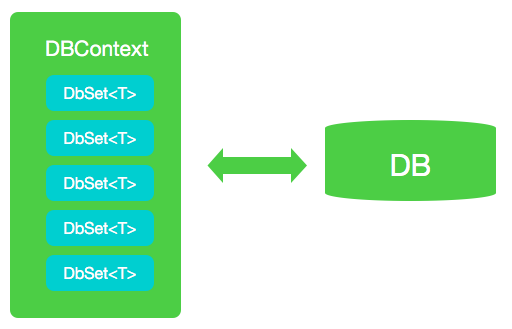

# DB Migration With EF

目前在ASP.NET中使用的方案是EF Core, EF Core主要做这几个工作：

1. 创建模型
2. 管理数据库架构

## 知识点概要

EF 框架中，将数据视为对象并负责与之进行交互的主类是 `DbContext`

使用 `DbContext` 上下文的时候，我们推荐你定义一个从 `DbContext` 派生的类，并且定义一个公开的 `DbSet` 属性用于表示上下文中指定的实体集合(或者直接理解成数据库里面的一个表)



从逻辑上讲，DBContext 映射到具有 DBContext 可理解的表的特定数据库

在 DBContext 子类中，我们可以创建类型为 DbSet<T> 的属性。 泛型类型参数 T 将是一种类型的实体

## Demo中演示 

1. 数据模型创建，Migration的初次创建，DB根据`code first`生成 (见Finally1文件夹)
    1. 创建一个`Student`数据类，然后创建对应的DBConext
    2. 使用dotnet cli 生成Migration和snap,并且更新数据库
    ```bash
    dotnet ef migrations add firstMigration

    dotnet ef database update

    ```
    3. 加一个初始化DB的过程，插入一些DEMO数据,见`DbInitializer.cs`
    4. 运行（dotnet run）, 浏览 http://localhost:51674
    5. 对页面数据进行增删改查
2. 更改数据模型，重新生成关于更改的Migration (见Finally2文件夹)
    1. 对`Student`数据类，添加年龄`age`字段
        - 修改CURD页面显示新的`age`字段
        - 修改`StudentsController`添加对新字段的处理
    2. 使用dotnet cli 生成Migration和snap,并且更新数据库
    ```bash
        dotnet ef migrations add SecondMigration

    dotnet ef database update

    ```
    3. 运行，再次查看http://localhost:51674


