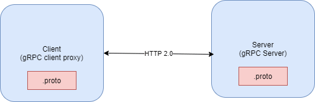
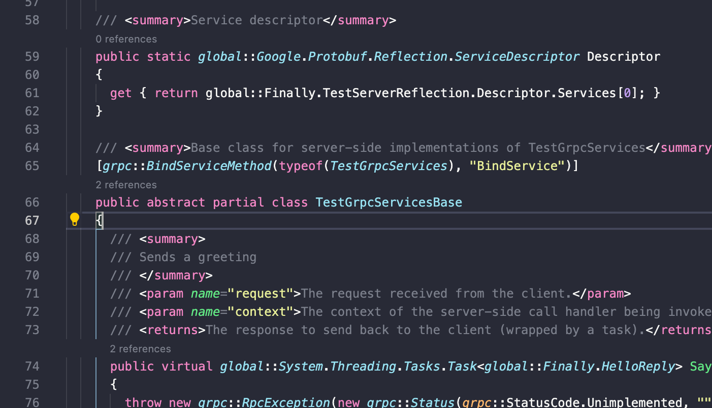
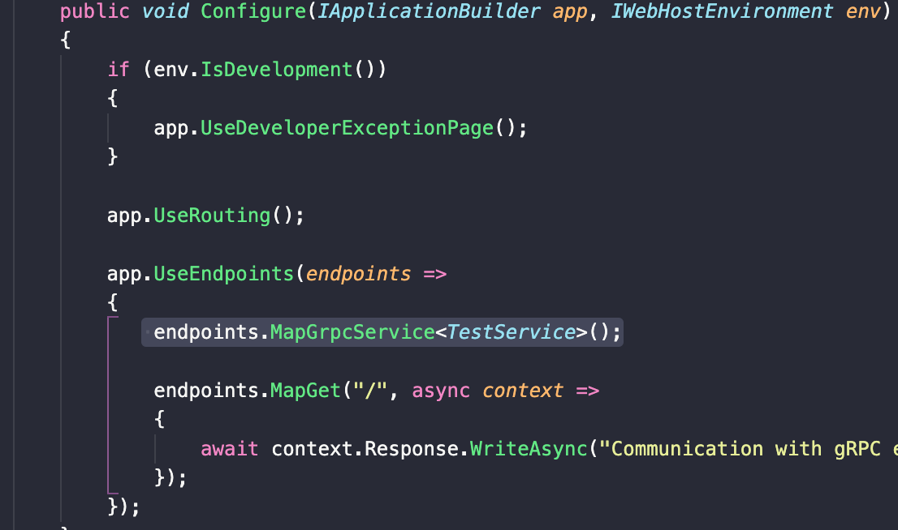

# ASP.NET core 中创建gRPC客户端和服务器

## gRPC的一些知识要点：
gRPC 是一个由Google开源的，跨语言的，高性能的远程过程调用（RPC）框架。 gRPC使客户端和服务端应用程序可以透明地进行通信，并简化了连接系统的构建。它使用HTTP/2作为通信协议，使用 Protocol Buffers 作为序列化协议
引用[微软文档](https://docs.microsoft.com/en-us/aspnet/core/grpc/index?view=aspnetcore-3.0)的说法：

- 它的主要优点：
    - 现代高性能轻量级 RPC 框架。
    - 约定优先的 API 开发，默认使用 Protocol Buffers 作为描述语言，允许与语言无关的实现。
    - 可用于多种语言的工具，以生成强类型的服务器和客户端。
    - 支持客户端，服务器双向流调用。
    - 通过Protocol Buffers二进制序列化减少网络使用。
    - 使用 HTTP/2 进行传输

- 这些优点使gRPC非常适合：
    - 高性能轻量级微服务 - gRPC设计为低延迟和高吞吐量通信，非常适合需要高性能的轻量级微服务。
    - 多语言混合开发 - gRPC工具支持所有流行的开发语言，使gRPC成为多语言开发环境的理想选择。
    - 点对点实时通信 - gRPC对双向流调用提供出色的支持。gRPC服务可以实时推送消息而无需轮询。
    - 网络受限环境 - 使用 Protocol Buffers二进制序列化消息，该序列化始终小于等效的JSON消息，对网络带宽需求比JSON小。

- 不建议使用gRPC的场景：
    - 浏览器可访问的API - 浏览器不完全支持gRPC。虽然gRPC-Web可以提供浏览器支持，但是它有局限性，引入了服务器代理
    - 广播实时通信 - gRPC支持通过流进行实时通信，但不存在向已注册连接广播消息的概念
    - 进程间通信 - 进程必须承载HTTP/2才能接受传入的gRPC调用，对于Windows，进程间通信管道是一种更快速的方法。

- 一个简单的图示例：
</br>


- 目前GRPC主要有两种数据流模式：
    1. 最简单的调用，客户端发送一个请求，然后得到server的一个回复
    2. 加入了流的概念, 即客户端和服务端发送的request包含在数据流里面


 - .net core 上已经有现成的模版取生成grpc的服务端，所以可以直接：
 ```
 dotnet new grpc

 ```
- 如果是从一个最简单的控制台应用开始，那么就应该添加3个grpc所依赖的包，在DEMO的客户端的生成中就是手动添加以下三个包
    - Grpc.Tools
    - Grpc.Core
    - Grpc.AspNetCore

- gRPC的核心在一个叫`xx.proto`的文件，它定义了通信用的很多协议字段，例如在DEMO中（Server版）
详细解释参考[GRPC RPOTO](https://grpc.io/docs/what-is-grpc/introduction/)
```proto
syntax = "proto3";

option csharp_namespace = "Finally";

package greet;

// The greeting service definition.
service Greeter {
  // Sends a greeting
  rpc SayHello (HelloRequest) returns (HelloReply);
}

// The request message containing the user's name.
message HelloRequest {
  string name = 1;
}

// The response message containing the greetings.
message HelloReply {
  string message = 1;
}
```


## Demo 演示客户端发送一个简单的GRPC Request，到服务端接受并返回消息。

1. 创建一个GRPC Server （位于Server文件夹中）
    - 使用命令创建（Initial中的状态）
    ```bash
    dotnet new grpc
    ```
    - 修改默认的`greet.proto` 为`TestServer.proto`,然后修改其中的内容
        ``` C#
            syntax = "proto3";

            option csharp_namespace = "Finally";

            package TestServer;

            service TestGrpcServices {

            rpc SayHello (HelloRequest) returns (HelloReply);
            }

            message HelloRequest {
            string name = 1;
            }

            message HelloReply {
            string message = 1;
            }
        ```
    - 修改`csproj`文件：
    ``` xml
        <Project Sdk="Microsoft.NET.Sdk.Web">

        <PropertyGroup>
            <TargetFramework>net5.0</TargetFramework>
        </PropertyGroup>

        <ItemGroup>
            <Protobuf Include="Protos\TestServer.proto" GrpcServices="Server" />
        </ItemGroup>

        <ItemGroup>
            <PackageReference Include="Grpc.AspNetCore" Version="2.34.0" />
        </ItemGroup>

        </Project>
    ```

    - build, 先把原来的greetService相关的逻辑注释掉，然后build GRPC会自动生成用于交互的类，然后我们可以继承它，来写自己的逻辑
    ```bash
    dotnet build
    ```

    - build过后可以发现在 /Server/obj/Debug/net5.0/Protos 下面已经有自动生成的文件`TestServer.cs` `TestServerGrpc.cs` , 然后打开`TestServerGrpc.cs` ，发现如图所示下面的代码, 有个抽象类叫`TestGrpcServicesBase`
    
    - 编写自己的类继承`TestGrpcServicesBase`
    ```C#
        public class TestService : TestGrpcServices.TestGrpcServicesBase
        {
            public override Task<HelloReply> SayHello(HelloRequest request, ServerCallContext context)
            {
                return Task.FromResult(new HelloReply
                {
                    Message = "Hello " + request.Name + "GRPC Service has receieve your request"
                });
            }
        }
    ```

    - 在`Startup.cs`中添加GRPC服务的调用：
    

    - Server就已经创建好了

2. 创建一个Client (位于Client文件夹中)
    - 使用最简单的控制台，`dotnet new console`
    - 把Server文件夹下面的`\Protos\TestSever.proto`拷贝到Client下面的Protos文件夹下（先新建一个Protos文件夹），并且加入csproj文件中
    ```xml
        <ItemGroup>
            <Protobuf Include="Protos\TestServer.proto" GrpcServices="Client" />
        </ItemGroup>

    ```
    - 修改名空间为Client项目下面的名空间
    - 添加3个依赖包：
        - Grpc.Tools （`dotnet add package Grpc.Tools`)
        - Grpc.Core（`dotnet add package Grpc.Core`)
        - Grpc.AspNetCore（`dotnet add package Grpc.AspNetCore`)
    - build, `dotnet build`
    - 在`Program.cs`中编写自己的逻辑,见Final中的`Program.cs`
        - 特别针对于MacOS, 因为Kersel在Mac上用不了HTTP/2, 所以演示不能用Https,要特殊处理一下：
        ```C#
        public static IHostBuilder CreateHostBuilder(string[] args) =>
             Host.CreateDefaultBuilder(args).ConfigureWebHostDefaults(webBuilder =>
                {
                    webBuilder.ConfigureKestrel(options =>
                    {
                        // Setup a HTTP/2 endpoint without TLS.
                        options.ListenLocalhost(5000, o => o.Protocols = 
                            HttpProtocols.Http2);
                    });
                    webBuilder.UseStartup<Startup>();
                });

        ```


3. 先运行Server后运行Client: 分别前后在Server和Client文件夹中运行`dotnet run`

4. 在Client的控制台界面中看到Server端给予的回复。


## 参考文档
[GRPC](https://grpc.io/docs/)


[Unable to start ASP.NET Core gRPC app on macOS](https://docs.microsoft.com/en-us/aspnet/core/grpc/troubleshoot?view=aspnetcore-5.0#unable-to-start-aspnet-core-grpc-app-on-macos)


