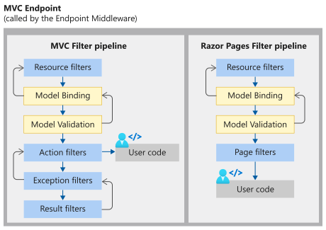

# ASP.NET CORE 中间件

## 什么是中间件？
详细参考[MSDN- ASP.NET Core Middleware](https://docs.microsoft.com/zh-cn/aspnet/core/fundamentals/middleware/?view=aspnetcore-5.0)

简单用3个图概括：
1. 就是服务器用来处理一个请求的一连串过程，代替了原来ASP.NET的Module和Hanlder：


2. 一个http request会经过的中间件（中间件生命周期）：


3. 在MVC EndPoint中的流程：


## 已经内置好的中间件
微软为了规范，安全，和使用方便，特意先做好了一些非常关键的中间件，比如
- 管认证的Authentication （暴露的方法 app.UseAuthentication()）
- 管权限的Authorization（暴露的方法 app.Authorization()）
- 管错误管理的ExceptionHandler（暴露的方法 app.ExceptionHandler()）
- 管请求重定向的UseHttpsRedirection（暴露的方法 app.UseHttpsRedirection()）
- 管静态资源的StaticFiles（暴露的方法 app.StaticFiles()）
- 管服务器路由的Routing，（暴露的方法 app.Routing()）
- 等

## 我们自己定制一个中间件（DEMO）

1. 目的：自定义中间件通过查询字符串设置当前请求的区域性
2. 步骤：
    1. 创建我们用来存放自定义中间件的的文件夹（取名`CustomMiddleWare`）
    2. 创建一个类文件（.cs）取名`RequestCultureMiddleware`
    3. 在`RequestCultureMiddleware.cs`中输入代码（见Demo）
    4. 在startup.cs中输入调用：
    ```C#
            public void Configure(IApplicationBuilder app, IWebHostEnvironment env)
        {
            app.UseRequestCulture();
            app.Run(async (context) =>
            {
                await context.Response.WriteAsync($"Hello {CultureInfo.CurrentCulture.DisplayName}");
            });
        }
    ```
    4. 运行测试：
        1. dotnet run 
        2. 打开浏览器访问：https://localhost:5001/?culture=en-us , 可以看到 The LocalCurrencySymbol is "$"
        3. 打开浏览器访问：https://localhost:5001/?culture=zh-cn , 可以看到 The LocalCurrencySymbol is "¥"