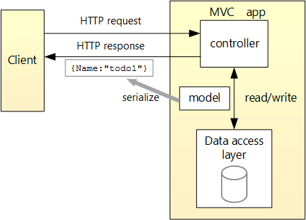

# ASP.NET Core Web API 

## 认识API
WebAPI,简单来说就是服务器与客户端（不管浏览器或者是桌面端）交互数据的接口，常见的应用场景：
- 用户验证登陆
- 在线信息管理（增删改查）
- 数据上传下载
- 各种形式的被需要用来交互的数据（一般会是json格式）

一个感性认识就是随便我们打开一个网站的页面，然后打开浏览器的调试控制台，在`NetWork`里面就能看到具体的情况：
- 浏览器端发送了一个`GET Request`
    
- 服务器给出了一个response, 带着json格式的数据
    

## 程序中的API流程
- 一般来说我们会在后端的`webserver`上架设`webAPI`,ASP.NET 的传统做法就是MVC形式的，包括`.net core` 里面也是如此：
- 


- 具体到代码层的一个参考，一般来说有几点：
    1. 我们自己写的类要继承`ControllerBase`
    2. 可以使用`Attribute`，如`[Route("[controller]")]`,`[HttpGet]`来标注对应的路由映射和操作webapi的方式，如`get`
    ```C#
    namespace Finally.Controllers
    {
        [ApiController]
        [Route("[controller]")]
        public class WeatherForecastController : ControllerBase
        {
            private static readonly string[] Summaries = new[]
            {
                "Freezing", "Bracing", "Chilly", "Cool", "Mild", "Warm", "Balmy", "Hot", "Sweltering", "Scorching"
            };

            private readonly ILogger<WeatherForecastController> _logger;

            public WeatherForecastController(ILogger<WeatherForecastController> logger)
            {
                _logger = logger;
            }

            [HttpGet]
            public IEnumerable<WeatherForecast> Get()
            {
                var rng = new Random();
                return Enumerable.Range(1, 5).Select(index => new WeatherForecast
                {
                    Date = DateTime.Now.AddDays(index),
                    TemperatureC = rng.Next(-20, 55),
                    Summary = Summaries[rng.Next(Summaries.Length)]
                })
                .ToArray();
            }
        }
    }
    ```
## 上传和下载

- 上传
    - ASP.NET Core 支持使用缓冲的模型绑定（针对较小文件）和无缓冲的流式传输（针对较大文件）上传一个或多个文件。

    - 常见的文件存储选项有：
        - <font color=#5079B3>数据库</font>
        对于小型文件上传，数据库通常快于物理存储（文件系统或网络共享）选项。
        相对于物理存储选项，数据库通常更为便利，因为检索数据库记录来获取用户数据可同时提供文件内容（如头像图像）。
        相对于使用数据存储服务，数据库的成本可能更低。
        - <font color=#5079B3>物理存储（文件系统或网络共享）</font>
        对于大型文件上传：
        数据库限制可能会限制上传的大小。
        相对于数据库存储，物理存储通常成本更高。
        相对于使用数据存储服务，物理存储的成本可能更低。
        应用的进程必须具有存储位置的读写权限。 切勿授予执行权限。
        - <font color=#5079B3>数据存储服务（例如，Azure Blob 存储）</font>
        服务通常通过本地解决方案提供提升的可伸缩性和复原能力，而它们往往受单一故障点的影响。
        在大型存储基础结构方案中，服务的成本可能更低。

- 下载
    - ASP.NET CORE 提供FileResult这种类型的ActionResult，可以直接返回文件结果，不需要直接处理HttpResponse。
    - 通过Stream可以直接返回文件流供浏览器下载

## DEMO
Demo要做的API
- 从行为上满足操作 get,post,put,Delete (https://localhost:6001/swagger/index.html)
- Demo要做的API从满足两种业务场景
    - 文件的上传和下载 (https://localhost:6001)
        - 缓存 （DEMO）
        - 数据流 
    - 普通数据交互


## 参考

[ASP.NET Core WebAPI](https://docs.microsoft.com/zh-cn/aspnet/core/web-api/?view=aspnetcore-5.0)


